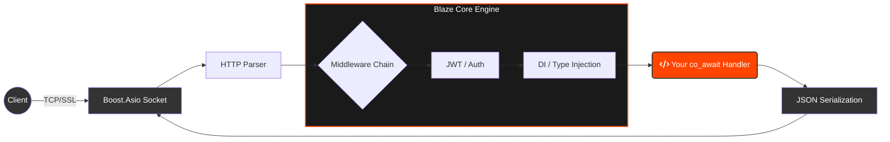

<div align="center">
  

[](https://github.com/Creed-Petitt/blaze/actions/workflows/ci.yml)


  <p>
    <a href="#features">Features</a> •
    <a href="#installation">Installation</a> •
    <a href="#quick-start">Quick Start</a> •
    <a href="docs/MANUAL.md">Documentation</a>
  </p>
</div>

---

**Blaze** is a high-performance, zero-config C++20 web framework built for peak developer experience. It combines a non-blocking engine with an elegant API to build the fastest, cleanest backends on the web.

## Features

*   **170,000+ req/sec** (plaintext) and **140,000+ req/sec** (JSON) with sub 1ms latency.
*   **Typed Injection**: Zero-boilerplate access to `Path<T>`, `Body<T>`, and `Query<T>`.
*   **Automatic Validation**: Define a `validate()` method on your models, and Blaze enforces it automatically.
*   **Interactive API Docs**: Built-in Swagger UI and OpenAPI generation at `/docs`.
*   **Built-in Auth & Security**: JWT Middleware, Rate Limiting, and CORS out of the box.
*   **Modern C++20**: Built solely for Coroutines (`co_await`).

## Requirements

Blaze is tested and verified to work out-of-the-box on:
*   **Ubuntu** (22.04+)
*   **Fedora** (40+) / **RHEL** (9+)
*   **macOS** (Apple Silicon/Intel)

> **Note:** The installer (`install.sh`) handles all system dependencies (CMake, OpenSSL, Drivers) automatically for you.

## Installation

Install the **Blaze CLI** to scaffold and run projects with zero configuration.

### Option 1: Quick Install (Recommended)
```bash
curl -fsSL https://raw.githubusercontent.com/Creed-Petitt/blaze/main/install.sh | bash
```

### Option 2: Build from Source
```bash
git clone https://github.com/Creed-Petitt/blaze.git
cd blaze
./install.sh
```

### Usage
Once installed, create and run your first project:
```bash
# Interactive Scaffolding
blaze init my-api

# Start Development (Hot-Reload Enabled)
cd my-api
blaze run --watch
```

## Quick Start

Create a high-performance, validated API with Dependency Injection in less than 20 lines.

```cpp
#include <blaze/app.h>
#include <blaze/wrappers.h> // Path, Body, Query

using namespace blaze;

struct User { 
    int id; 
    std::string name; 
    
    // Automatic Validation
    void validate() const {
        if (id < 0) throw BadRequest("Invalid ID");
    }
};
BLAZE_MODEL(User, id, name)

int main() {
    App app;

    // Framework parses JSON, Validates it, and Injects 'user'
    app.post("/users", [](Body<User> user) -> Async<Json> {
        co_return Json({
            {"status", "created"}, 
            {"user_id", user.id} 
        }); 
    });

    app.listen(8080);
}
```

### Request Lifecycle



## CLI Reference

Blaze comes with a powerful CLI to manage your entire development lifecycle. See the **[Full CLI Reference](docs/CLI.md)** for more details.

| Command | Description |
| :--- |:---|
| `init` | Scaffold a new project (interactive). |
| `run -w` | Build and run your app with Hot-Reload. |
| `test` | Run the Catch2 test suite with clean summaries. |
| `add` | Inject features (postgres, mysql, frontend) into an existing project. |
| `dev` | Run C++ and Vite in parallel with unified logs. |
| `doctor` | Verify your system requirements. |


## Testing and Security

Every commit is audited via an automated **CI pipeline** in GitHub Actions. Feel free to view **[Full Testing Pipeline](docs/TESTING.md)** for more info.

*   **Logic Integrity:** Comprehensive **Catch2** unit tests for every core component (Routing, DI, JSON).
*   **Memory Safety:** Automatic memory audit via **AddressSanitizer (ASan)** and **UBSan**.
*   **Concurrency Safety:** Race condition and deadlock detection via **ThreadSanitizer (TSan)**.
*   **Fuzz Tested:** Resilient against malformed packets and malicious payloads.


## License

Blaze is 100% open-source under the [MIT](LICENSE) license.
