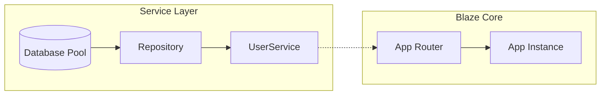

# Dependency Injection (IoC)

Blaze features a type-safe, thread-safe Dependency Injection container, allowing you to write decoupled code that is easy to test. The diagram below showcases how a database service is implemented and managed by the framework.



## 1. Registering Services
Services are registered in the `App` instance during startup.

### Singleton (One instance for the whole app)
```cpp
// Blaze creates the instance
app.provide<EmailService>();

// With arguments
app.provide<Config>("config.json");
```

### Interface Mapping
Map a concrete implementation to an abstract interface.

```cpp
app.service(Postgres::open(...)).as<Database>();
```

## 2. Injection via BLAZE_DEPS
Use the `BLAZE_DEPS` macro to tell Blaze what a class needs. Blaze will automatically find those services in the container and pass them to the constructor.

```cpp
class UserService {
public:
    BLAZE_DEPS(Database, Logger)
    
    UserService(std::shared_ptr<Database> db, std::shared_ptr<Logger> log)
        : db_(db), log_(log) {}
};
```

## 3. Magic Route Injection
This is the most powerful feature. You can request any registered service as an argument in your route lambdas.

```cpp
app.get("/api", [](UserService& users, Database& db) -> Async<Json> {
    // 'users' and 'db' are injected automatically by the framework
    co_return Json({{"status", "active"}});
});
```

## 4. Lifetimes
*   **Singleton**: One instance shared across all threads/requests. (Default for `provide<T>`).
*   **Transient**: A new instance created every time it's requested. (`provide_transient<T>`).
