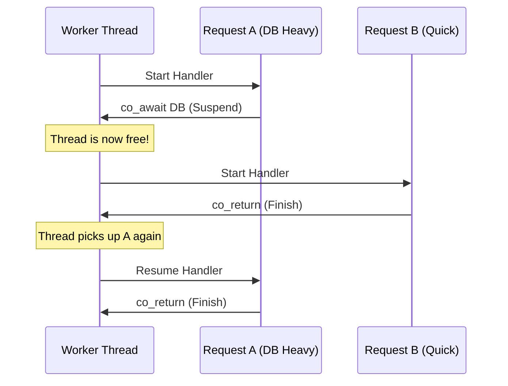

# Blaze v1.0.0 Documentation

Welcome to the official manual for the Blaze Framework.

## Detailed Guides

To get the most out of Blaze, explore our detailed guides:

1.  **[The CLI](CLI.md)**: Master the build system, `blaze add`, and `blaze doctor`.
2.  **[Dependency Injection](DI.md)**: Learn how to use the IoC container and Magic Route Injection.
3.  **[Database & ORM](DATABASE.md)**: Setting up drivers and using the `BLAZE_MODEL` macro.
4.  **[WebSockets & Real-time](WEBSOCKETS.md)**: Scaling to thousands of connections with the Dream API.
5.  **[Middleware & Security](MIDDLEWARE.md)**: JWT Authentication, Logging, and Static Files.
6.  **[Advanced Features](ADVANCED.md)**: Route Groups, Environment variables, and Server configuration.
7.  **[Typed Injection & Validation](INJECTION.md)**: Learn about Path, Body, Query, and Context injection.
8.  **[Smart Repository & ORM](REPOSITORY.md)**: Zero-boilerplate CRUD and the Fluent Query Builder.
9.  **[API Documentation](ADVANCED.md#6-automatic-api-docs-swagger)**: Learn about the built-in Swagger UI and OpenAPI generator.

---

## Framework Philosophy

Blaze was built to solve the "Performance vs. Productivity" dilemma in C++. 

### 1. Zero Manual Memory Management
We believe `new` and `delete` should be relics of the past. Blaze uses `std::shared_ptr` and `std::move` semantics internally to guarantee memory safety without garbage collection pauses.

### 2. Modular by Design
Legacy C++ frameworks force you to link massive 50MB binaries. Blaze is granular.
*   Need a database? `blaze add postgres`.
*   Need a frontend? `blaze add frontend`.
*   Need nothing? You get a <5MB binary.

### 3. Modern C++20 Coroutines
Blaze uses `co_await` to let you write asynchronous, non-blocking code that looks synchronous.

```cpp
// This looks blocking, but it suspends!
auto user = co_await db.query("SELECT * FROM users");
auto data = co_await http.get("https://api.example.com");
```

The diagram below goes into detail on exactly how Blaze works under the hood.


