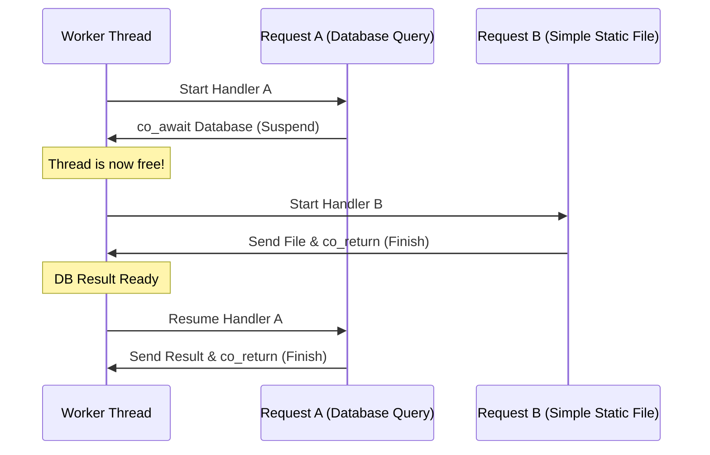
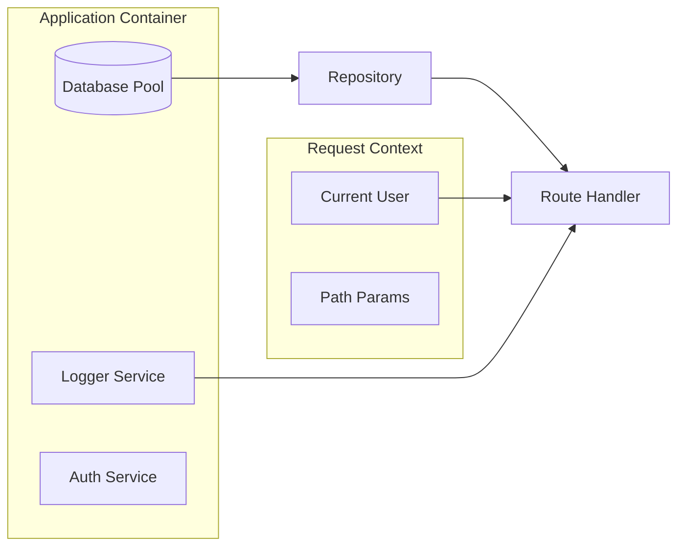

# Architecture & Design

Blaze is engineered for high-concurrency workloads where I/O latency is the primary bottleneck. This guide explores the design patterns and technical choices that make Blaze unique.

---

## 1. The Async Core

Blaze is built on top of **Boost.Asio** and C++20 **Coroutines**. Unlike traditional frameworks that use one thread per connection (which wastes memory and CPU), Blaze uses a small pool of worker threads to handle thousands of connections.

### How it works:
When a handler reaches a `co_await` point (like a database query), the current function is "frozen" and its state is saved. The worker thread is then immediately freed to handle a different request. Once the database returns the data, the original function is "thawed" and resumes exactly where it left off.



---

## 2. Dependency Injection Graph

Blaze's DI container is a **Scoped Service Provider**. It manages the lifecycle and delivery of objects across your application.

### The Service Hierarchy
1.  **Application Scope**: Singletons created once at startup (e.g., Database Pool, Global Config).
2.  **Request Scope**: Objects created or modified during a single HTTP request (e.g., The current User, a Trace ID).



---

## 3. Reflection-Driven ORM

Blaze uses C++20 reflection (via `boost::describe`) to inspect your structs at compile-time. This is why you only need one line (`BLAZE_MODEL`) to get full JSON and Database support.

### The Metadata Pipeline:
1.  **Definition**: You define a struct with `BLAZE_MODEL`.
2.  **Inspection**: At compile-time, Blaze generates a list of fields and types.
3.  **Mapping**: 
    *   **JSON**: Blaze maps `struct.name` to `"name": "value"`.
    *   **SQL**: Blaze maps `struct.name` to `SELECT "name" FROM ...`.
4.  **Zero Overhead**: Because this happens at compile-time, there is no performance penalty compared to writing manual mapping code.

---

## 4. Security by Default

Blaze is designed with a "Secure-by-Default" philosophy:
*   **SQL Injection**: Every query in the `Repository` and `Database` classes is parameterized. You never concatenate strings to build SQL.
*   **Memory Safety**: Blaze uses RAII and smart pointers throughout. Raw `new` and `delete` are virtually non-existent in the codebase.
*   **Buffer Safety**: Powered by `boost::beast`, the HTTP parser handles malformed or oversized requests gracefully, preventing common overflow attacks.

---

## 5. Lifecycle & Graceful Shutdown

Blaze ensures that your application shuts down cleanly without dropping in-flight requests.

### The Shutdown Sequence
1.  **Signal Trap**: The server listens for `SIGINT` (Ctrl+C) and `SIGTERM`.
2.  **Listener Stop**: The server immediately stops accepting new connections.
3.  **In-flight Completion**: Existing requests are allowed to finish their execution loop.
4.  **Safety Timeout**: A configurable `shutdown_timeout` (default 30s) ensures that if a session is hung (e.g., a massive upload or a slow database query), the process eventually force-stops.

```cpp
app.config().shutdown_timeout = 5; // Allow 5 seconds for cleanup
```

---

## 6. Zero-Copy I/O

Blaze is designed to be "Memory-Transparent" when handling large assets. This is achieved through a specialized response pipeline that distinguishes between dynamic and static content.

### The Response Pipeline
When a request is processed, `App::handle_request` returns a `Response` object rather than a raw string. The `HttpSession` then performs an architectural optimization:

1.  **Dynamic Content**: If the response contains a body (JSON, HTML), it uses `http::string_body`.
2.  **Static Assets**: If the response points to a file path (via `res.file()`), Blaze swaps the body type to `http::file_body`.

This allows the operating system to stream the file directly from the file system to the network interface, bypassing the application's memory space entirely and avoiding expensive data copies.
