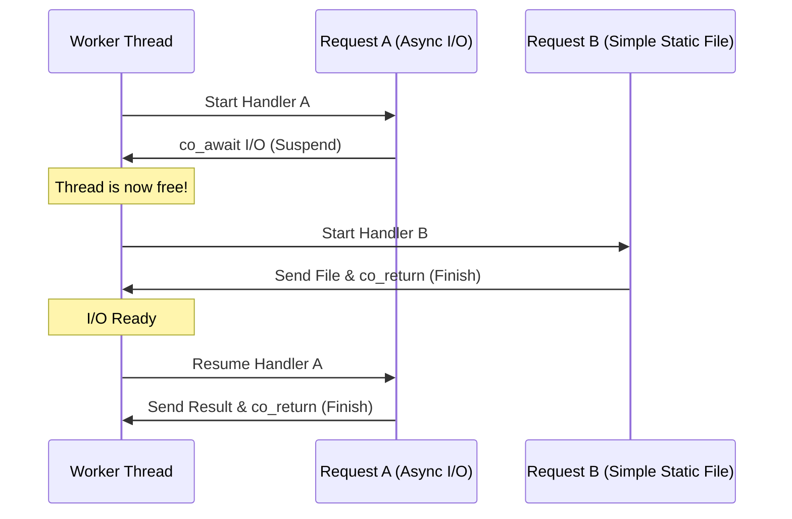
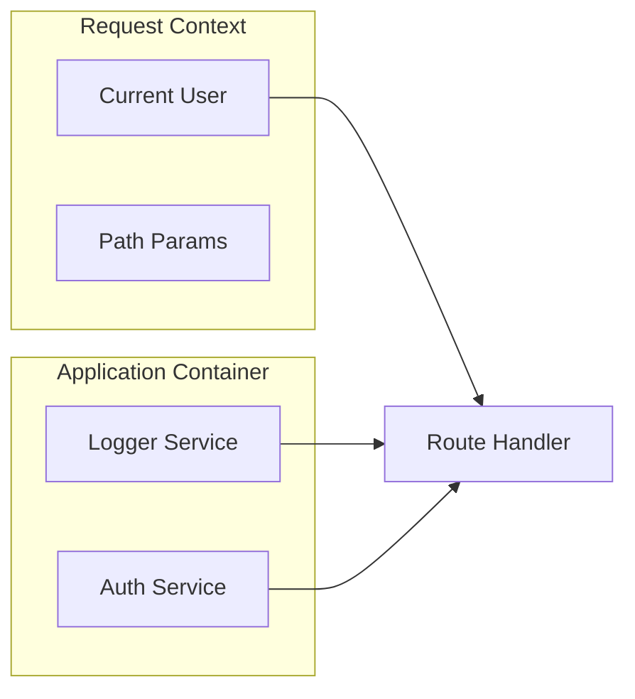

# Architecture & Design

Blaze is engineered for high-concurrency workloads where I/O latency is the primary bottleneck. This guide explores the design patterns and technical choices that make Blaze unique.

---

## 1. The Async Core

Blaze is built on top of **Boost.Asio** and C++20 **Coroutines**. Unlike traditional frameworks that use one thread per connection (which wastes memory and CPU), Blaze uses a small pool of worker threads to handle thousands of connections.

### How it works:
When a handler reaches a `co_await` point, the current function is suspended and its state is saved. The worker thread is then immediately freed to handle a different request. Once the awaited operation completes, the original function resumes exactly where it left off.


```mermaid
sequenceDiagram
    participant T as Worker Thread
    participant R1 as Request A (Async I/O)
    participant R2 as Request B (Simple Static File)
    
    T->>R1: Start Handler A
    R1->>T: co_await I/O (Suspend)
    Note over T: Thread is now free!
    T->>R2: Start Handler B
    R2->>T: Send File & co_return (Finish)
    Note over T: I/O Ready
    T->>R1: Resume Handler A
    R1->>T: Send Result & co_return (Finish)
```

---

## 2. Services And Request Context

Blaze keeps services explicit. The app owns long-lived shared services, and each request carries a non-owning pointer to that app registry.

### The Service Hierarchy
1.  **Application Scope**: Services created once at startup.
2.  **Request Scope**: Objects created or modified during a single HTTP request (e.g., The current User, a Trace ID).


```mermaid
graph LR
    subgraph AppContainer [Application Container]
        Logger[Logger Service]
        Auth[Auth Service]
    end

    subgraph ReqContext [Request Context]
        User[Current User]
        Params[Path Params]
    end

    Auth --> Handler[Route Handler]
    User --> Handler
    Logger --> Handler
```

---

## 3. Typed JSON Mapping

Blaze uses Boost.Describe to map your structs to and from JSON when you opt into `BLAZE_MODEL`.

### The Metadata Pipeline:
1.  **Definition**: You define a struct with `BLAZE_MODEL`.
2.  **Inspection**: At compile-time, Blaze generates a list of fields and types.
3.  **Mapping**: 
    *   **JSON**: Blaze maps `struct.name` to `"name": "value"`.
4.  **Low Overhead**: The field list is known at compile time.

---

## 4. Security by Default

Blaze is designed with a "Secure-by-Default" philosophy:
*   **Memory Safety**: Blaze uses RAII and smart pointers throughout. Raw `new` and `delete` are virtually non-existent in the codebase.
*   **Buffer Safety**: Powered by `boost::beast`, the HTTP parser handles malformed or oversized requests gracefully, preventing common overflow attacks.

---

## 5. Lifecycle & Graceful Shutdown

Blaze ensures that your application shuts down cleanly without dropping in-flight requests.

### The Shutdown Sequence
1.  **Signal Trap**: The server listens for `SIGINT` (Ctrl+C) and `SIGTERM`.
2.  **Listener Stop**: The server immediately stops accepting new connections.
3.  **In-flight Completion**: Existing requests are allowed to finish their execution loop.
4.  **Safety Timeout**: A configurable `shutdown_timeout` (default 30s) ensures that if a session is hung (e.g., a massive upload or a slow database query), the process eventually force-stops.

```cpp
app.config().shutdown_timeout = 5; // Allow 5 seconds for cleanup
```

---

## 6. Zero-Copy I/O

Blaze is designed to be "Memory-Transparent" when handling large assets. This is achieved through a specialized response pipeline that distinguishes between dynamic and static content.

### The Response Pipeline
When a request is processed, `App::handle_request` returns a `Response` object rather than a raw string. The `HttpSession` then performs an architectural optimization:

1.  **Dynamic Content**: If the response contains a body (JSON, HTML), it uses `http::string_body`.
2.  **Static Assets**: If the response points to a file path (via `res.file()`), Blaze swaps the body type to `http::file_body`.

This allows the operating system to stream the file directly from the file system to the network interface, bypassing the application's memory space entirely and avoiding expensive data copies.
